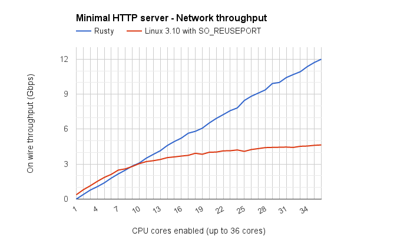
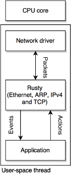

# Rusty

Rusty is a light-weight, user-space, event-driven and highly-scalable TCP/IP
stack. It has been developed to run on a
[EZChip *TILE-Gx36* processor](http://www.tilera.com/products/?ezchip=585&spage=614).

**A simple web-server using this new framework got a 2.6× performance
improvement**, when compared to the same application layer running on the new
reusable TCP sockets introduced in Linux 3.9. The web-server was able to deliver
static HTML pages at a rate of 12 Gbps on a *TILE-Gx36* powered device.

Currently, the stack only works on the *TILE-Gx* microarchitecture with the
*mPIPE* user-space network driver.

The software is licensed under the GNU General Public License version 3, and has
been written in the context of
[my Master's thesis](https://github.com/RaphaelJ/master-thesis/raw/master/thesis.pdf)
for the University of Liège.

# Architecture

Rusty is design around a share-nothing and event-driven architecture.

Rusty takes full control of cores it runs on (it disables preemptive
multi-threading on these cores). Each of these cores is accountable for a subset
of the TCP connections that the server handle, and connections are not shared
between cores (a given connection will always be handled by the same core).
This enables scalability.

The application layer is composed of event-handlers that processes events of the
network stack (such as a new connection or a new arrival of data).
Event-handlers runs in the same thread and context that the network stack. This
removes the overhead of context-switches. **The network stack is not backward
compatible with software written using BSD sockets**.

Details of this architecture are given in
[my Master's thesis](https://github.com/RaphaelJ/master-thesis/raw/master/thesis.pdf).

# Compiling

## Requirements

Rusty requires GCC 4.8.

*UG504-Gx-MDE-GettingStartedGuide* of the official *Tilera* documentation
explains how to install GCC 4.8 on a *TILE-Gx* device.

## Cross compilation using CMake

Rusty uses the CMake build tool. When compiling Rusty on the host system for the
*TILE-Gx* architecture, CMake must be configured to use the cross-compiling GCC.

This can be done, while being in the root directory of the project, by executing
this command:

    cmake . -DCMAKE_TOOLCHAIN_FILE=tilera-toolchain.cmake

## Compiling

The project can then be compiled by running the `make` command in the root
directory.

This will build:

* The network stack.
* A simple web-server and a simple echo server in the `/app` directory.

# Writing an application using Rusty

Two sample applications (a very simple web-server and an echo server) are
available in the `/app` directory. The second chapter of
[my Master's thesis](https://github.com/RaphaelJ/master-thesis/raw/master/thesis.pdf)
(starting at page 15) explains how the echo server is implemented.

Currently, only server sockets are supported (i.e. using the `listen()` call).
The application layer is not able to initiate a client connection.

# Running the web-server

## Data-plane tiles

The framework features a simple web-server in the `/app` directory. Rusty
applications require multiple *data-plane* cores. The *TILE-Gx* device can be
booted with data-plane cores using the `--hvx "dataplane="` option when 
calling the `tile-monitor` command:

    tile-monitor --root --hvx "dataplane=0-35"

The previous command starts the *TILE-Gx* device with 35 data-plane cores.

## ARP table entries

The network stack currently **does not** support dynamic ARP entries when
running on multiple cores. The `static_arp_entries` array on line 52 in
`app/httpd.cpp` must be filled with static ARP entries.

The application must be recompiled (using `make`) each time new static ARP
entries are added.

## Starting the web-server

The web-server must be given the TCP port and the network links it will listen
on, the root directory containing the served files,  and the number of worker
cores to use:

    Usage: ./app/httpd <TCP port> <root dir> <n links> [<link> <ipv4 of this link> <n workers on this link>]...

The following example starts the web-server on two links with two IPv4
addresses (10.0.2.2 on `xgbe1` and 10.0.3.2 on `xgbe2`), with 18 cores dedicated
for the first link, and 17 cores for the second. The web-server serves pages
from the `/bench/pages` directory on port 80:

    ./app/httpd 80 bench/pages/ 2 xgbe1 10.0.2.2 18 xgbe2 10.0.2.3 17

About 30 cores are required to fill a single 10 Gbps Ethernet link.

## Benchmarking the web-server

A large number of concurrent HTTP requests can be generated on a second device
using the [wrk](https://github.com/wg/wrk) scriptable HTTP benchmarking tool.

The `bench/` directory contains a bzip2 archive with the 500 most popular front
pages of the World Wide Web (according to [Alexa](http://alexa.com/topsites)).
The directory also contains a Lua script that generates random requests to these
500 pages. The following command generates random HTTP requests using the
`bench_pages.lua` script using 1,000 concurrent TCP connections and 6 threads
during 30 seconds:

    wrk -s bench/bench_pages.lua -c 1000 -d 30s -t 6 http://10.0.2.2

After 30 seconds, wrk will generate a textual report with the performances of
the web-server. When the web-server is running on multiple links, several
instances of wrk could be run concurrently, querying different IPv4 addresses.

# Similar projects

* [Seastar](http://seastar-project.org), a more advanced highly-scalable network
  stack. **You should prefer Seastar to Rusty for any production setup**.
* [mTCP](http://shader.kaist.edu/mtcp/), another user-space, highly-scalable,
  network stack with a different architecture.
